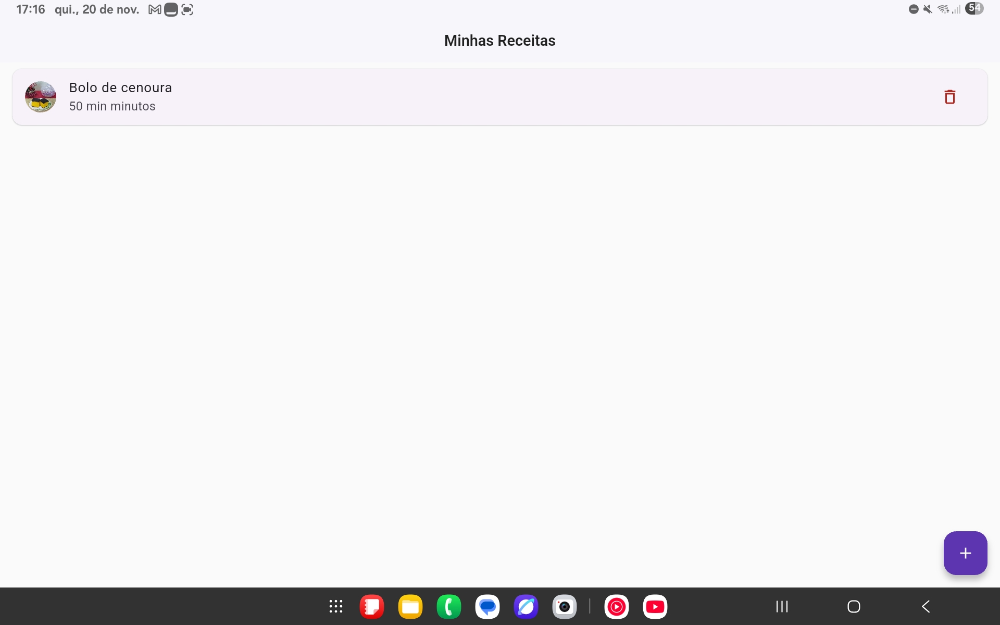
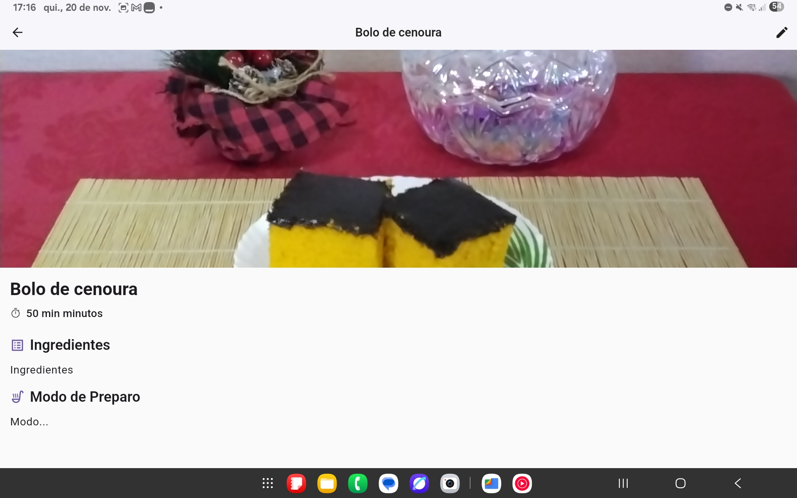
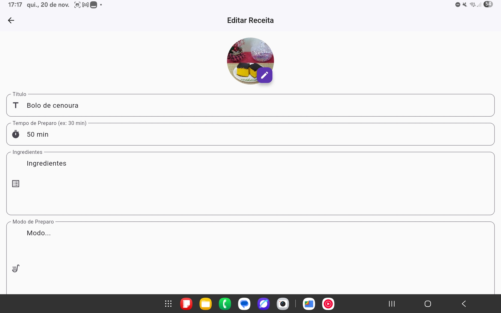
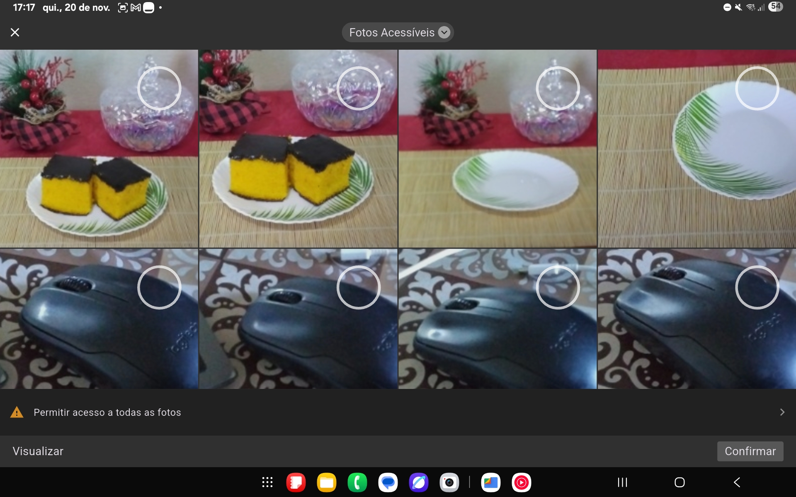

# Minhas Receitas 🍳

Um aplicativo móvel para gestão pessoal de receitas culinárias, desenvolvido em **Flutter** com foco em arquitetura limpa, performance e funcionamento offline.  
Este projeto foi desenvolvido como atividade prática da disciplina **M4.25 | Desenvolvimento de Aplicativos Móveis nas Engenharias** da faculdade **Unimar**.

---

## 📱 Funcionalidades

### CRUD Completo
- **Criar**: Cadastro de novas receitas com título, tempo de preparo, ingredientes, modo de preparo e foto.  
- **Ler**: Listagem visual das receitas e tela de detalhes ("Modo Cozinha") focada na leitura.  
- **Atualizar**: Edição completa de todos os campos e substituição da foto.  
- **Deletar**: Remoção de receitas com diálogo de confirmação de segurança.  

### Persistência Local (Offline-First)
- Utiliza **Hive (NoSQL)** para salvar dados instantaneamente.  
- O app funciona 100% sem internet.  

### Recursos Nativos
- **Câmera e Galeria**: Integração robusta usando `wechat_camera_picker` para seleção de fotos.  
- **Splash Screen**: Tela de abertura nativa personalizada.  
- **Ícones**: Ícones adaptativos configurados para Android e iOS.  

### UX/UI Aprimorada
- Feedback visual (**SnackBars**) para sucesso e erro.  
- Campos de texto otimizados (multilinhas, capitalização de frases, ação de "Próximo" no teclado).  
- Tradução completa da interface de seleção de imagens para **Português (BR)**.  

---

## 🛠️ Arquitetura e Tecnologias

O projeto segue rigorosamente os princípios da **Clean Architecture** combinada com o padrão de gestão de estado **MVI (Model-View-Intent)**.

- **Linguagem**: Dart  
- **Framework**: Flutter  
- **Gerenciamento de Estado**: Stream / RxDart (*BehaviorSubject & PublishSubject*)  
- **Injeção de Dependência**: get_it  
- **Banco de Dados Local**: hive e hive_flutter  
- **Mídia**: wechat_camera_picker (substituindo o image_picker padrão para melhor suporte a permissões e UI)  
- **Comparação de Objetos**: equatable  

### Estrutura de Pastas
```
lib/
├── app/                  # Configurações globais (DI, Temas, Traduções)
├── core/                 # Interfaces e utilitários compartilhados
├── features/
│   └── receitas/
│       ├── data/         # Implementação de Repositórios e DataSources (Hive)
│       ├── domain/       # Entidades, Interfaces de Repositório e UseCases
│       └── presentation/ # Camada de UI (MVI)
│           ├── detalhe_receita/ # Tela de Visualização
│           ├── form_receita/    # Tela de Criação/Edição
│           └── lista_receitas/  # Tela Principal
└── main.dart
```

---

## 🚀 Como Rodar o Projeto

### Pré-requisitos
- Flutter SDK instalado e configurado.  
- Dispositivo Android ou iOS (físico ou emulador).  

### Instalação
```bash
# Clone o repositório
git clone https://github.com/willians-dos-santos/app_receitas.git
cd app_receitas

# Instale as dependências
flutter pub get

# Gere os adaptadores do Hive (necessário para o banco de dados)
dart run build_runner build --delete-conflicting-outputs

# Execute o aplicativo
flutter run
```

---

## 📸 Capturas de Tela
|  |  |  |  |

---

## 🔮 Melhorias Futuras
- [ ] Filtro de busca por nome ou ingrediente.  
- [ ] Categorização por tags (Doce, Salgado, Vegano).  
- [ ] Integração com IA (**Gemini Nano**) para sugestão de receitas offline.  
- [ ] Backup na nuvem (Firebase).  

---

### Desenvolvido por **Willians Santos**